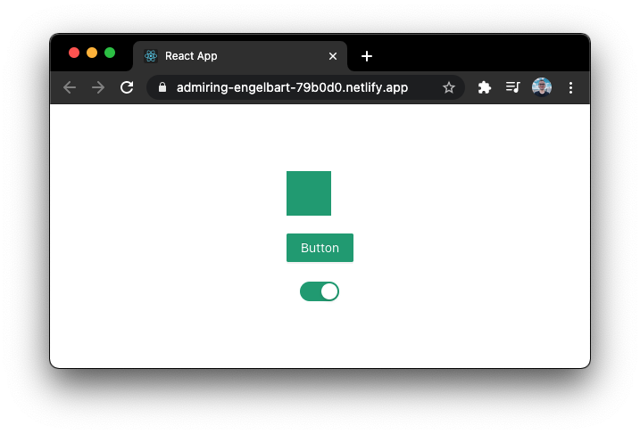

# cra-antd-theme

<a href="https://admiring-engelbart-79b0d0.netlify.app" target="_blank"></a>

[Live demo](https://admiring-engelbart-79b0d0.netlify.app/)

## Setup
```
yarn
yarn start
```

## Features
- [x] [create-react-app](https://create-react-app.dev/)
- [x] [Ant Design](http://ant.design/)
- [x] [Styled Components](https://styled-components.com/)
- [x] [Customized Theme](https://ant.design/docs/react/customize-theme)

## Issues
- [ ] VSCode is showing errors for less syntax inside styled-components
- [ ] Unit tests are breaking (because of the above) ⬆️
- [ ] Every time we need to customize theme variables, the front-end server needs to be restarted 😞